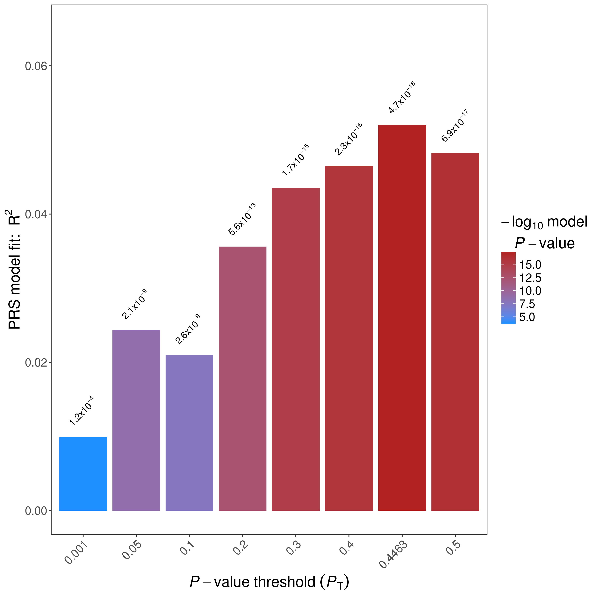
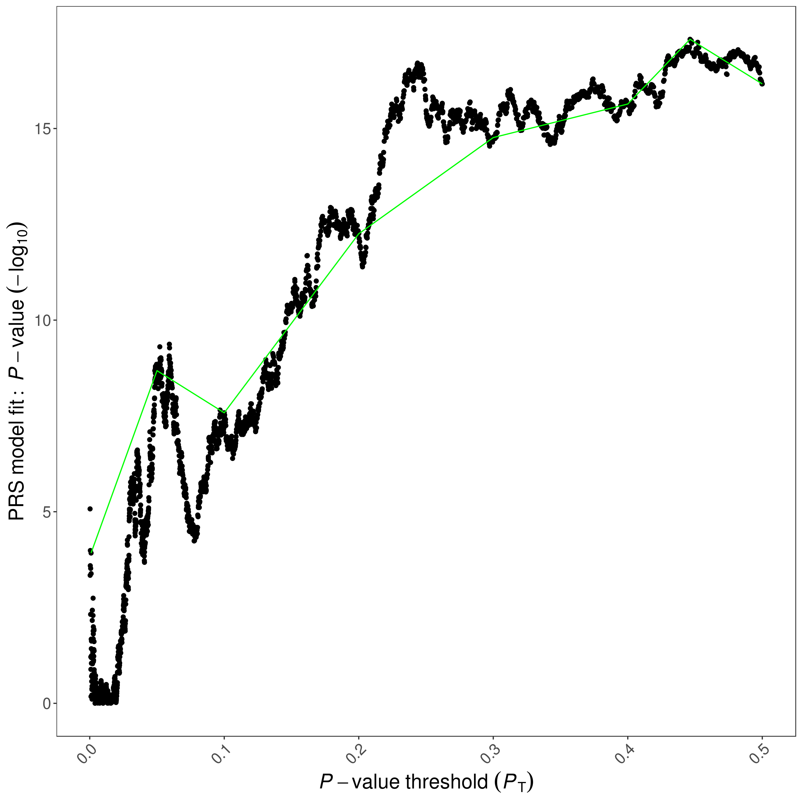
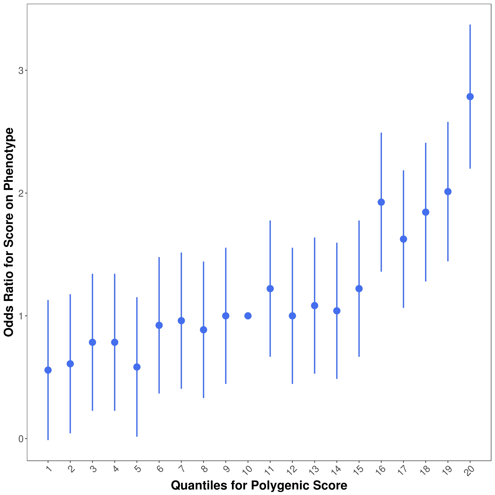

# Input Data
## Base Dataset
Base (i.e. GWAS) data must be provided as a whitespace delimited file containing association analysis results for SNPs on the base phenotype.
PRSice has no problem reading in a gzipped base file.

If you are using output from PLINK, then please make sure there is a column for the effect allele (A1) and specify it with `--A1` option.
On the other hand, if you are using another form of output, then you can provide the column headers using the `--chr`, `--A1`, `--A2`, `--stat`, `--snp`, `--bp`, `--se`, `--pvalue` options

!!! important

    For PRSice to run, the base file must contain the effect allele (--A1), effect size estimates (--stat), p-value for association (--pvalue), and the snp id (--snp).

If the input file does not contain a column header, then you can specify the column using their index (start counting from 0) with the `--index` flag.

e.g. if the first column of the file contains the p-value information, you can use:
``
--pvalue 0 --index
``

Below is an example input file:

|SNP|CHR|BP|A1|A2|OR|SE|P|
|:-:|:-:|:-:|:-:|:-:|:-:|:-:|:-:|
|rs3094315|1|752566|A|G|0.9912|0.0229|0.7009|
|rs3131972|1|752721|A|G|1.007|0.0228|0.769|
|rs3131971|1|752894|T|C|1.003|0.0232|0.8962|

and the parameters can either be

``
--snp SNP --chr CHR --bp BP --A1 A1 --A2 A2 --stat OR --se SE --pvalue P
``

or

``
--snp 0 --chr 1 --bp 2 --A1 3 --A2 4 --stat 5 --se 6 --pvalue 7 --index
``

Strand flips are automatically detected and accounted for

If an imputation info score or the minor allele frequencies (MAF) are also included in the file, you can use
`--info-base <Info Name>,<Info Threshold>` and `--maf-base <MAF Name>,<MAF Threshold>` to filter
SNPs based on their INFO score and MAF respectively.

For binary trait base file, you can also filter the MAF according the the case and control separately using

```
--maf-base <Name for Control>,<Threshold for Control>:<Name for Case>,<Threshold for Case>
```

By default, PRSice will look for the following column names automatically from your base file header if `--index` was not provided:
> CHR, BP, A1, A2, SNP, P, INFO, SE (case sensitive) and OR / BETA (case insensitive)

If you don't want the specific column to be included e.g. You don't want to perform info score filtering but your file contains an
INFO column, you can use `--no-default` to disable all the defaults of PRSice.
PRSice will ignore any columns that were not found in your file (e.g. If you specified `--A2 B` but none of your column header is *B*,  then PRSice will treat it as if no *A2* information is presented)


## Target Dataset
Currently we support two different formats

### PLINK Binary
A target dataset in PLINK binary format must consist of three files: **.bed**, **.bim**, and a **.fam** file - where bed contains the compressed genotype data, bim contains the SNP information and fam contains the family information. Currently we only support a SNP major PLINK input (default output of the latest PLINK program).

The **.bed** and **.bim** file must have the same prefix.

If you want to use a **.fam** file with a different prefix from the **.bed** and **.bim** file, you can do
```
--target <bim bed prefix>,<fam file>
```

!!! warning

    You MUST ensure the fam file contains the correct number of samples

Missing phenotype data can be coded as NA, or -9 for binary traits and NA for quantitative traits.
!!! Note

    -9 will NOT be considered as missing for quantitative traits

If your binary file is separated into individual chromosomes, then you can place an # in place of the chromosome number.
PRSice will automatically substitute # with 1-22

i.e. If your files are chr1.<bed|bim|fam>,chr2.<bed|bim|fam>,...,chr22.<bed|bim|fam>, just use
```
--target chr#
```

!!! Note

    If an external fam file is provided, the substitution will not be performed on it. This is because all chromosome should have the same fam file. fam file from any of the chromosome should be ok

### BGEN
We also support BGEN v1.2. To specify a BGEN file, you simply add `--type bgen` or `--ld-type bgen` to your PRSice command

As BGEN does not store the phenotype information and sometime not even the sample ID, you **must** provide
a phenotype file (`--pheno-file`) for PRSice to run. Or you can provide a sample file using
```
--target <bgen prefix>,<sample file>
```
!!! Note

    We will still require this sample file even if you are doing `--no-regress` as we do want the sample ID.  we might loosen this requirement later on.

With BGEN, a number of other PRSice options become effective:
- `--hard`: Normally, with BGEN format, we will calculate the PRS using the dosage information.
But you can ask for hard-thresholding by using the `--hard` option. Then we will code the SNP as the genotype with
probability larger than threshold specified by `--hard-thres`. If no such genotype is presented, the SNP will be
coded as missing
- `--hard-thres`: The genotype probability threshold. SNPs with no genotype having a probability larger than this
threshold will be treated as missing

## Phenotype files
Sometimes, the phenotype information are not stored within the genotype files.
In this scenario, a phenotype file can be provided to PRSice using the `--pheno-file`
parameter.
The first two column of the phenotype file should be the FID and the IID, or if
`--ignore-fid` is set, the first column should be the IID.
The rest of the columns can be the phenotype(s).

If the user want to specify a trait within the phenotype file, the file must
contain a column header and the column name for the trait can be provided using
`--pheno-col` parameter. Multiple column name can be provided via a comma separated
list: e.g. `--pheno-col A,B,C,D`. Trait(s) not found within the phenotype file will
be automatically skipped.

!!! important

    The column name should not contain *space* nor *comma*

!!! note

    When multiple traits are provided, the column name will be appended to
    the output prefix.


# LD reference
When your target sample is small (e.g. < 500 samples), you might want to use an external reference panel
to improve the LD estimation for clumping.

The LD reference follows the same notion as the target dataset. Simply use
```
--ld <LD refernce>
```
to specify your LD reference panel file and `--ld-type` to specify the format

When a LD reference file is not provided and `--no-clump` was not specified, the target file
will be used as the LD reference panel

!!! Important

    Any parameters with the `--ld` prefix will only work on the file specified by the `--ld` parameter.
    That is, if a LD reference file is not provided, none of the `--ld-*` options will be used.
    If you would like to apply a different filtering to the target file when using it as the reference panel (e.g. using only controls), you will need to provide that target file separately to the `--ld` parameter

!!! Note

    If the LD reference panel is in BGEN format, then it will always be hard coded when estimating the LD

# Clumping
By default, PRSice will perform Clumping to remove SNPs that are in LD with each other.
Similar to PLINK, the r<sup>2</sup> values computed by PRSice are based on maximum likelihood haplotype frequency estimates.
We do not differentiate case and control when we calculate the r<sup>2</sup>.
You can force r<sup>2</sup> calculation in control using the `--ld` and `--ld-keep`/`--ld-remove` options

You can change the value using `--clump-kb`, `--clump-r2` and `--clump-p` option.
Or you can disable clumping altogether using `--no-clump`

# Output of Results
## Figures

!!! Note

    Hereon, we will assume _[Name]_ is the output prefix specified using `--output` and _[date]_ is the date when the analysis was performed.

PRSice will always generate a bar plot displaying the model fit of the PRS at P-value threshold as indicated by `--bar-levels`

The plot will be named as *[Name]\_BARPLOT\_[date].png* , where _[date]_ is today’s date and _[Name]_ is the output name specified using `--output`.
An example bar plot:




If `--fastscore` is not specified, a high-resolution plot named *[Name]\_HIGH-RES\_PLOT\_[date].png* will be generated.

This plot present the model fit of PRS calculated at all P-value thresholds.

A green line connects points showing the model fit at the broad P-value thresholds used in the corresponding bar plot are also added.
An example high-resolution plot:



If `--quantile [number of quantile]` is specified, a quantile plot named [Name]\_QUANTILE\_PLOT\_[date].png will be generated.
The quantile plot provide an illustration of the effect of increaseing PRS on predcited risk of phenotype.
An example quantile plot:




## PRS model-fit
A file containing the PRS model fit across thresholds is named *[Name].prsice*; this is stored as

> Threshold, R2, P-value, Coefficient, Stndard Deviation and Number of SNPs at this threshold

## Scores for each individual
A file containing PRS for each individual at the best-fit PRS named

*[Name].best* is provide.
This file has the format of:

> FID,IID,PRS at best threshold, Has Phenotype

Where the has phenotype column indicate whether the sample contain all the required phenotype for PRSice
analysis
(e.g. Samples with missing phenotype/covariate will not be included in the regression. These samples will be indicated as "No" under the has phenotype column)

If `--all-score` option is used, a file named *[Name].all.score* is also generated


Please note, if `--all-score` options is used, the PRS for each individual at all threshold will be given.
In the event where the target sample size is large and a lot of threshold are tested, this file can be large.


## Summary Information
Information of the best model fit of each phenotype and gene set is stored in *[Name].summary*.
The summary file contain the following fields:

1. **Phenotype** - Name of Phenotype
2. **Set** - Name of Gene Set
3. **Threshold** - Best P-value Threshold
4. **PRS.R2** - Variance explained by the PRS. If prevalence is provided, this will be adjusted for ascertainment
5. **Full.R2** - Variance explained by the full model (including the covariates). If prevalence is provided, this will be adjusted for ascertainment
6. **Null.R2** - Variance explained by the covariates. If prevalence is provided, this will be adjusted for ascertainment
7. **Prevalence** - Population prevalence as indicated by the user. "-" if not provided.
8. **Coefficient** - Regression coefficient of the model. Can provide insight of the direction of effect.
9. **P** - P value of the model fit
10. **Num_SNP** - Number of SNPs included in the model
11. **Empirical-P** - Only provided if permutation is performed. This is the empirical p-value and should account for multiple testing and over-fitting

## Log File
We value reproducible research. Therefore we try our best to make replicating PRSice run easier.
For every PRSice run, a log file named *[Name].log* is generated which contain the all the commands
used for the analysis and information regarding filtering, field selected etc.

This also allow users to quickly identify problems in the input dataset.
